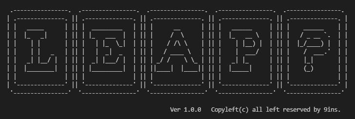

## What is Leap?
---
Leap? is alternatives of current Http servers or Web application servers
It just works like Http server but It can be used to heavy-duty services accoding to you wanna do for your needs.
Leap? is providing simple ways to build your web-based services.
You can easily build your service using inheritance of Leap? service meta interfaces or abstracts.
Leap? is providing a various filters for security, parsing and authenticating.

## Configuration for security.
---

## Configuration for filtering.
---

## How's different from legacy Http server.
---

## What's consisted of Leap server?
---

## How to make your own services.
---

## What's your preperation for using Leap services.
---

## Dynamic-Service-Supporting is how to help your system.
---

## How to integrate with JPA achitecture?
---

## How to communication with Big-Data infrastructure.
---

